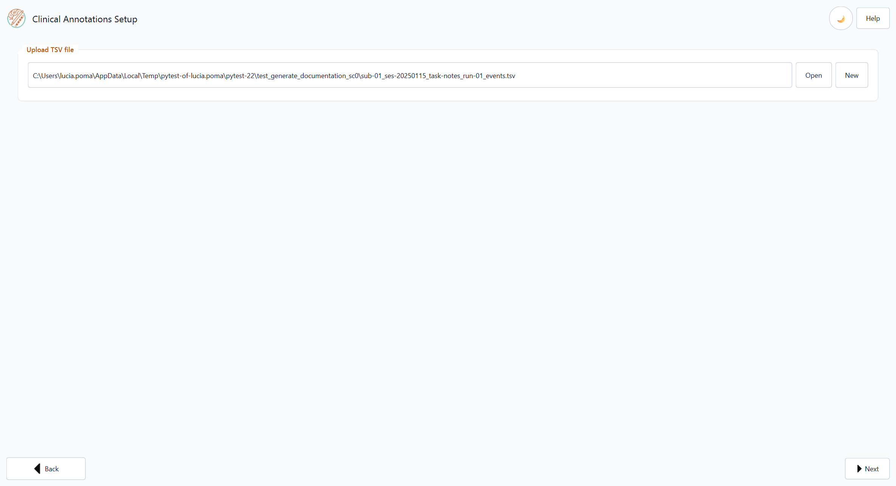
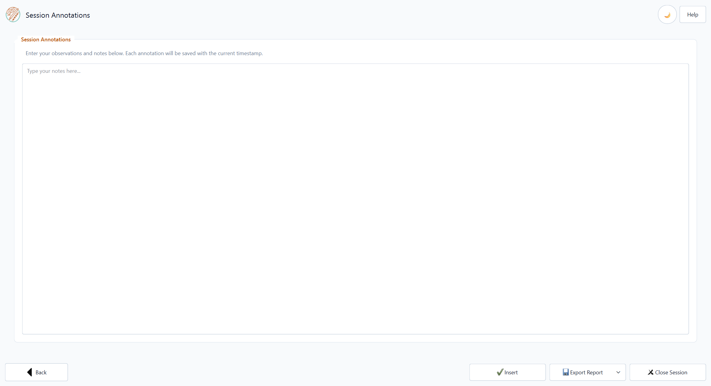

Annotations-only Workflow
=========================

The **Annotations-only Workflow** records timestamped text notes only. It does
not capture stimulation parameters or clinical or session scale values. Each
note is appended to its own annotations TSV file as you work. There is no merge
step and this workflow does not combine multiple files into one.

Use it for in-clinic observations, ward notes, or any visit where you need a
lightweight timestamped log without running the full programming workflow.

----

Opening the Annotations-only Workflow
-------------------------------------

From the home screen click **Annotations-only Workflow**.

On **Clinical Annotations Setup**, choose or create the TSV file:

* **Open** — load an existing ``*_task-notes_*_events.tsv`` file.
* **New** — enter **Patient ID** and **Run ID** in the dialog; **Session ID**
  is set automatically to today's date (``ses-YYYYMMDD``).  Pick the save
  location in the file dialog.
* Drag and drop a ``.tsv`` onto the path field.

Click **Next** to open the recording screen.

----

Recording an Annotation
------------------------

1. Type your note in the **Session Annotations** text area.
2. Click **Insert** to record an entry.

The entry is immediately appended to the list below with:

* **Timestamp** — current date and time (Eastern Time, aligned with Medtronic
  Percept logs).
* **Note text** — exactly as you typed it.

Entries are saved to the TSV file in real-time; no manual save is needed.

----

Output File
-----------

Annotations use a **dedicated** tab-separated format — not the programming-session
schema (no ``block_ID``, stimulation columns, or scale columns).  The BIDS-style
filename is::

   sub-<ID>_ses-<YYYYMMDD>_task-notes_run-<NN>_events.tsv

Each row is one annotation.  Columns (see also :doc:`output_format`):

.. list-table::
   :widths: 25 75
   :header-rows: 1

   * - Column
     - Content
   * - ``date``
     - Date of the annotation (``YYYY-MM-DD``)
   * - ``time``
     - Time of the annotation (``HH:MM:SS``)
   * - ``timezone``
     - Timezone abbreviation/offset at capture time
   * - ``notes``
     - The note text (same column name as in the Complete Workflow TSV)

----

Exporting a Report
------------------

Click **Export Report** → **Word Report** or **PDF Report** to generate a
simple document containing the full annotation log.

The report shows:

* Patient ID and session information (from the filename).
* A table with all annotations sorted by timestamp.

----

Closing
-------

Click **Close Session** when finished.  The file is automatically saved and the
application returns to the home screen.
