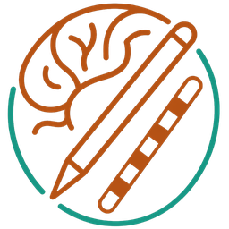

.. DBS Annotator documentation master file

DBS Annotator
=============

**DBS Annotator** is a desktop application for recording and analysing
Deep Brain Stimulation (DBS) clinical programming sessions.  It guides
the clinician or researcher through a DBS programming pipeline: initial
electrode configuration, clinical scales, and general annotations;
real-time stimulation adjustments; and session-specific scale changes and
notes.  Finally, it can generate structured Word and PDF reports from the
programming session data.

Developed at the **Brain Modulation Lab, Massachusetts General Hospital**
(Boston, USA), the **Wyss Center for Bio and Neuroengineering** (Geneva,
Switzerland), and **Charité Universitätsmedizin Berlin** (Germany).

.. note::

   **Version:** |release|

   Copyright © Massachusetts General Hospital, Wyss Center for Bio and
   Neuroengineering, and Charité Universitätsmedizin Berlin.

   **Contact:** lucia.poma@wysscenter.ch

----

.. toctree::
   :maxdepth: 2
   :caption: Getting Started

   installation
   overview

.. toctree::
   :maxdepth: 2
   :caption: User Guide

   quickstart
   workflow_complete
   workflow_annotations
   longitudinal_report
   output_format

.. toctree::
   :maxdepth: 1
   :caption: Reference

   faq
   changelog

.. toctree::
   :maxdepth: 1
   :caption: Developer Guide

   contributing
   releasing
   api

----

Quick Overview
--------------

.. list-table::
   :widths: 30 70
   :header-rows: 0

   * - **Complete Workflow**
     - Record stimulation parameters, clinical scales, and notes
       step-by-step in a timestamped TSV table.  Export a structured report
       (Word / PDF) with tables, electrode diagrams, and session-scale
       timeline charts.
   * - **Annotations-only Workflow**
     - Quick timestamped text notes.
   * - **Session and longitudinal reports**
     - Combine single or multiple session files into a single comparative
       document with overview tables, clinical and session-scale charts,
       electrode diagrams, and programming summaries.
   * - **BIDS-compliant output**
     - Data saved as
       ``sub-XXXX_ses-YYYYMMDD_task-<TASK>_run-XX_<type-of-data>.<ext>``.
   * - **Self-contained desktop app**
     - Packaged installers (``.msi``, ``.dmg``, ``.deb``); no separate
       Python runtime required.
