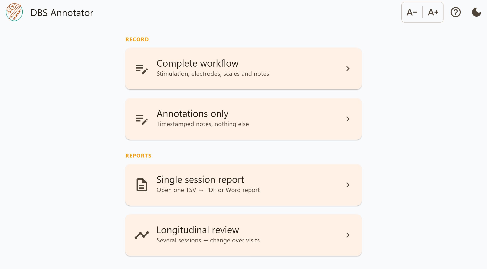

DBS Annotator
=============

.. image:: _static/logo.png
   :alt: DBS Annotator
   :width: 180px
   :align: center

|

**Record deep brain stimulation programming sessions at the bedside, and get
analysis-ready data out.**

DBS Annotator captures what actually happened during a DBS programming session —
the stimulation parameters tried on each contact, the clinical and session scale
ratings at every configuration, side effects, and free-text notes — and writes it
to :doc:`BIDS-named TSV files <output_format>` that go straight into analysis. It
also produces clinician-readable :doc:`PDF and Word reports <reports>` for the
patient record.

It runs **fully offline**: no account, no server, no telemetry. Tablet-first for
iPadOS and Android, with desktop builds for Linux, Windows and macOS.

.. note::

   This is research software. It documents what was recorded; it does not
   recommend stimulation settings. See :ref:`what-the-reports-do-not-say`.

At a glance
-----------

.. list-table::
   :header-rows: 1
   :widths: 30 70

   * - Aspect
     - Detail
   * - Platforms
     - iPadOS, Android, Linux, Windows, macOS — one codebase
   * - Data format
     - Tab-separated, BIDS-named, one row per (block, scale)
   * - Reports
     - PDF and Word, both built from the same numbers
   * - Connectivity
     - None required, ever
   * - Licence
     - MIT

.. toctree::
   :maxdepth: 2
   :caption: Getting started

   overview
   installation
   quickstart

.. toctree::
   :maxdepth: 2
   :caption: Workflows

   workflow_complete
   workflow_annotations

.. toctree::
   :maxdepth: 2
   :caption: Reference

   output_format
   reports
   faq

Release notes are published with each tagged release on
`GitHub <https://github.com/Brain-Modulation-Lab/DBSAnnotator/releases>`_.
