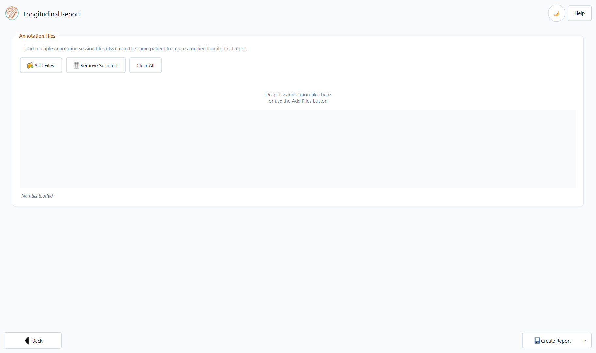
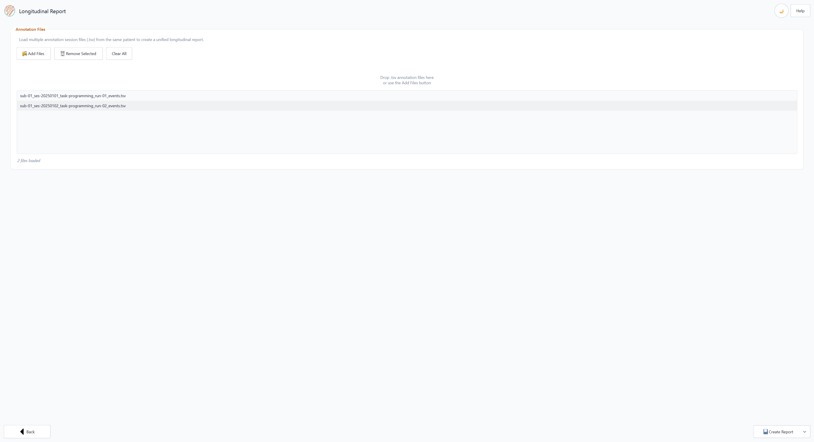
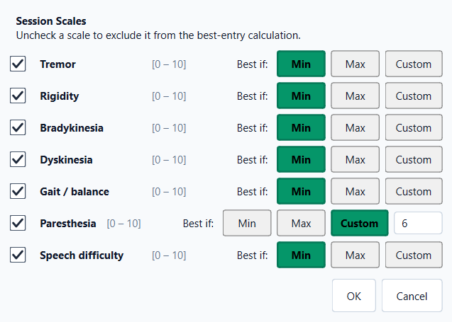
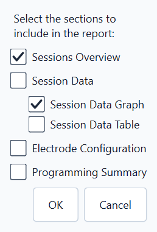
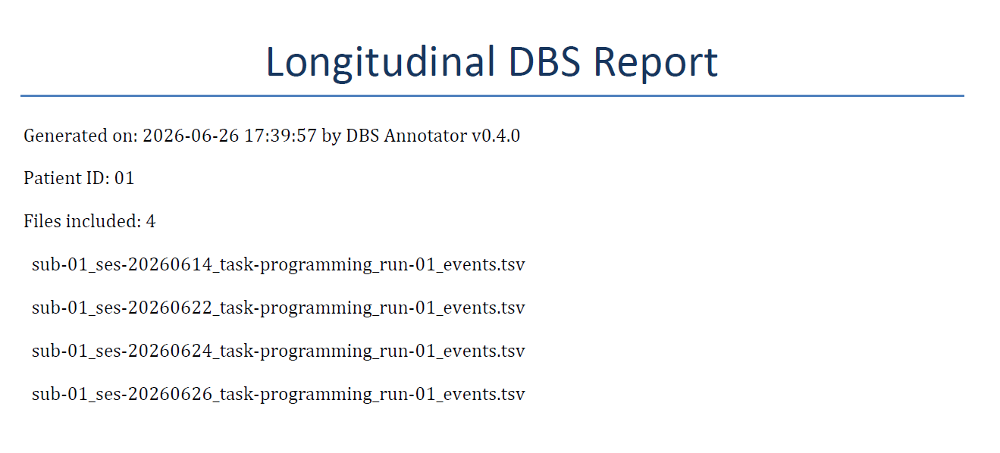
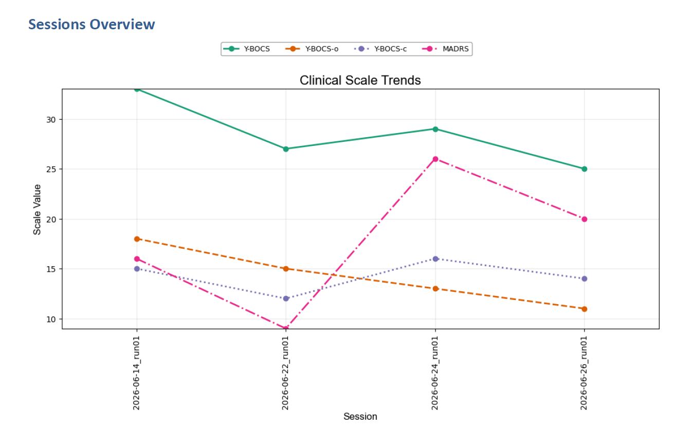
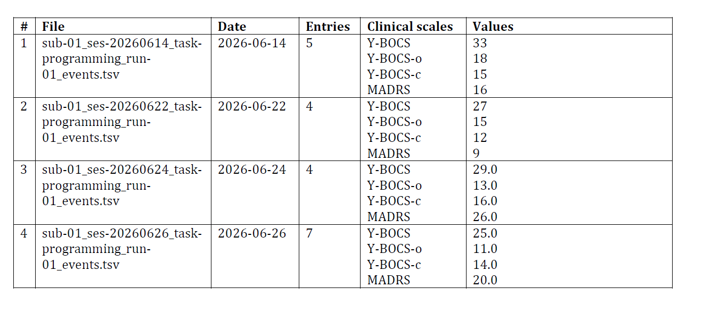
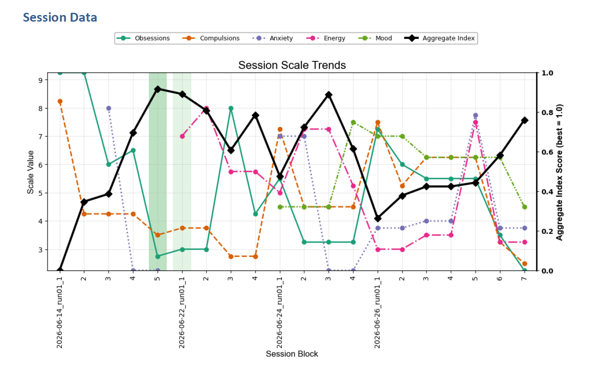
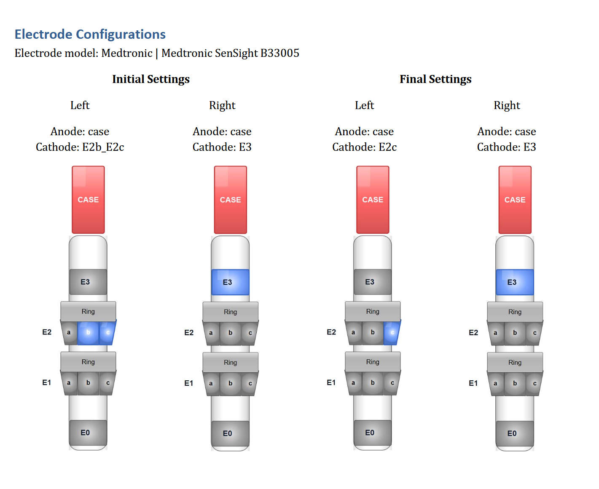
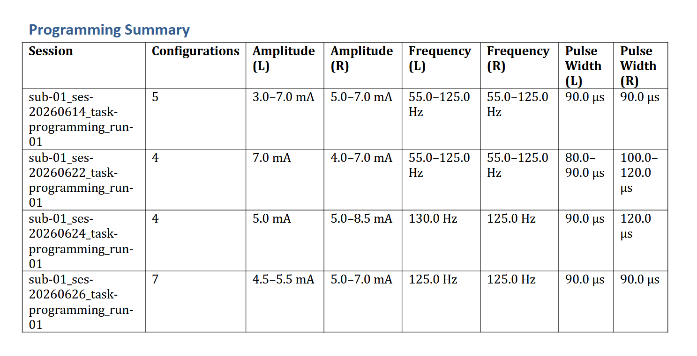

Longitudinal Report
===================

The Longitudinal Report workflow combines data from **multiple programming-session
TSV files** for the **same subject** into a single comparative document.  Use it
to track a patient's progression across visits.  Files must follow the BIDS
``task-programming`` naming convention (e.g.
``sub-01_ses-20250115_task-programming_run-01_events.tsv``).

----

Opening the Longitudinal View
------------------------------

From the home screen click **Longitudinal Report**.

----

Loading Session Files
----------------------

Add one or more **programming-session** TSV files from the same patient
(``task-programming`` in the filename).  You can load them in two ways:

Drag and Drop
^^^^^^^^^^^^^

Drag one or more files from Windows Explorer directly into the **file list
area** of the application.  Each file should match the BIDS pattern
``sub-<ID>_ses-<YYYYMMDD>_task-programming_run-<NN>_events.tsv`` (for example
``sub-01_ses-20250115_task-programming_run-01_events.tsv``).

Browse Button
^^^^^^^^^^^^^

Click **Add files** and use the file picker to select one or more
``*_task-programming_*_events.tsv`` files for the same subject.

Managing the File List
^^^^^^^^^^^^^^^^^^^^^^

.. list-table::
   :widths: 30 70
   :header-rows: 1

   * - Button
     - Action
   * - **Remove selected**
     - Removes the highlighted file from the list (does not delete it from disk).
   * - **Clear all**
     - Removes all files from the list.

.. tip::
   The files are processed in the order they appear in the list.  Drag rows
   to reorder them if needed.

.. note::
   All files must belong to the **same patient** and should be **programming
   sessions** (``task-programming``).  The application reads the patient ID from
   the BIDS filename and will warn you if files from different patients are
   mixed.

----

Generating the Report
----------------------

Click **Create Report** → **Word Report** or **PDF Report**.

Three dialogs appear before the file-save dialog:

Step 1 — Scale Optimisation
^^^^^^^^^^^^^^^^^^^^^^^^^^^^

Choose the optimisation target for each **session scale** and, when present,
each **clinical (baseline) scale** found across all loaded files.

For each scale, select:

* **Min** — lower values are better (e.g. UPDRS-III, Tremor, Y-BOCS).
* **Max** — higher values are better (e.g. Mood, Energy).
* **Custom** — enter a specific target value; the entry closest to that value
  is highlighted.

Uncheck a scale to exclude it entirely from best-entry highlighting.

Step 2 — Report Sections
^^^^^^^^^^^^^^^^^^^^^^^^^

Choose which sections to include.  By default **Sessions Overview** and
**Session Data Graph** are checked:

.. list-table::
   :widths: 35 15 50
   :header-rows: 1

   * - Section
     - Default
     - Description
   * - Sessions Overview
     - ✓
     - Summary table of all loaded sessions (date, entry count, baseline
       clinical scales) plus a **clinical scales timeline chart** across
       sessions.
   * - Session Data → Graph
     - ✓
     - **Session-scale timeline chart** across all configurations in all files
       (one subplot per scale; best entries highlighted).
   * - Session Data → Table
     - ☐
     - Combined table of all recorded entries across sessions (date column,
       stimulation parameters, scale values, notes).  Best entry per session
       highlighted.
   * - Electrode Configuration
     - ☐
     - Per-file Initial / Final electrode diagrams (Left and Right hemispheres).
   * - Programming Summary
     - ☐
     - Per-session parameter ranges (amplitude, frequency, pulse width) and
       number of configurations tested.

Step 3 — Save Location
^^^^^^^^^^^^^^^^^^^^^^^

Choose where to save the generated ``.docx`` or ``.pdf`` file.

----

Report Contents
----------------

The exported Word/PDF follows the same section order as the
:doc:`longitudinal summary on output_format <output_format>`.  Example
screenshots from a multi-session export (synthetic documentation data only;
not a real clinical case):

Title
^^^^^

Sessions Overview
^^^^^^^^^^^^^^^^^^

A **clinical scales timeline chart** (baseline ``is_initial = 1`` values per
session file) followed by a summary table with one row per loaded file:

.. list-table::
   :widths: 30 70
   :header-rows: 1

   * - Column
     - Content
   * - Session
     - Filename (BIDS label)
   * - Date
     - Date of the session extracted from the filename
   * - Entries
     - Number of stimulation configurations recorded
   * - Clinical scales
     - Names of baseline clinical scales recorded in Step 1
   * - Values
     - Corresponding baseline scores

Session Data
^^^^^^^^^^^^^

Depending on your section selection, the report includes a **session-scale
timeline chart** (values across programming blocks in all files), a **combined
data table**, or both.

* **Session Data Graph** — all acquisitions in one chart so you can spot the
  best configuration overall across visits.

* **Session Data Table** — same lateral layout as the
  :ref:`single-session session data table <session-report-session-table>`, with
  rows from **every** loaded file merged.  The first column is the entry
  **date**; laterality (L/R), stimulation parameters, scale values, and notes
  follow.  The best entry **per session** is highlighted in **green**.

Electrode Configuration
^^^^^^^^^^^^^^^^^^^^^^^^

For **each** loaded session file, the report adds a page with:

* **File / session label** as a sub-heading.
* **Electrode model** name and manufacturer.
* A borderless 4-column table:

  +------------------+------------------+------------------+------------------+
  | Initial — Left   | Initial — Right  | Final — Left     | Final — Right    |
  +==================+==================+==================+==================+
  | Contact diagram  | Contact diagram  | Contact diagram  | Contact diagram  |
  +------------------+------------------+------------------+------------------+

The layout matches the
:ref:`single-session electrode section <session-report-electrode-config>`; a page
break separates each file.

Programming Summary
^^^^^^^^^^^^^^^^^^^^

A table with one row per session showing:

* Number of configurations tested
* Amplitude range (Left / Right)
* Frequency range (Left / Right)
* Pulse width range (Left / Right)

----

Tips
----

* The report can be re-generated at any time — the source TSV files are never
  modified.
* For very long longitudinal histories (> 10 sessions) consider splitting the
  report into sub-periods.
