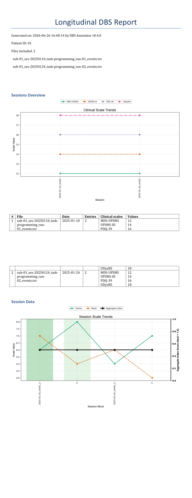

Output Format
=============

This page describes the data files produced by the application and the
structure of the exported reports.

----

TSV Data File
-------------

All session data is stored as a **tab-separated values** (``.tsv``) file.
One file is created per session; rows are appended in real-time as entries
are recorded.

Filename Convention
^^^^^^^^^^^^^^^^^^^

Filenames follow the `BIDS <https://bids.neuroimaging.io/>`_ pattern::

   sub-<PatientID>_ses-<YYYYMMDD>_task-<TASK>_run-<NN>_events.tsv

The ``task`` segment depends on which workflow created the file:

* **Complete Workflow** — ``task-programming`` (stimulation parameters, clinical
  and session scales, notes).
* **Annotations-only Workflow** — ``task-annotations`` (timestamped text annotations
  only; dedicated column schema — see *Annotations-only TSV columns* below).

Examples::

   sub-01_ses-20250315_task-programming_run-01_events.tsv
   sub-01_ses-20250315_task-annotations_run-01_events.tsv

Columns
^^^^^^^

The schema tables below are generated from the code-level constants in
``dbs_annotator.config``. This keeps the docs and writer implementation in sync.

.. include:: _generated/tsv_schema.inc.rst

.. note::
   When multiple cathode contacts are active, the ``left_cathode`` /
   ``right_cathode`` field contains comma-separated contact names and the
   amplitude field stores the **total** delivered current.  The per-contact
   split (in mA) is shown in the report but not stored in a separate column.

Row layout and ``block_ID``
^^^^^^^^^^^^^^^^^^^^^^^^^^^

Each **scale** is stored on its own row.  Rows that belong to the same
recording event (one Step 1 baseline or one Step 3 **Insert**) share the
same ``block_ID``; stimulation parameters, ``date``, ``time``, ``timezone``,
``program_ID``, ``electrode_model``, and ``notes`` are repeated on every row of
that block.  After each write, ``block_ID`` increments by one.

Example rows
^^^^^^^^^^^^

The table below is abbreviated (stimulation columns omitted on continuation
lines); in the real file every row includes the full column set.

.. code-block:: text

   date        time      timezone                 block_ID  session_ID  is_initial  scale_name   scale_value  program_ID  electrode_model      notes
   2025-03-15  10:02:31  Europe/Zurich +0100      0         1           1           MDS-UPDRS    28           A           Medtronic SenSight…  Baseline pre-stim
   2025-03-15  10:02:31  Europe/Zurich +0100      0         1           1           UPDRS-III    32           A           Medtronic SenSight…  Baseline pre-stim
   2025-03-15  10:15:44  Europe/Zurich +0100      1         1           0           Tremor       6.0          A           Medtronic SenSight…  Config 1
   2025-03-15  10:15:44  Europe/Zurich +0100      1         1           0           Rigidity     5.0          A           Medtronic SenSight…  Config 1
   2025-03-15  10:15:44  Europe/Zurich +0100      1         1           0           Bradykinesia 4.0          A           Medtronic SenSight…  Config 1
   2025-03-15  10:28:12  Europe/Zurich +0100      2         1           0           Tremor       4.0          B           Medtronic SenSight…  Config 2
   2025-03-15  10:28:12  Europe/Zurich +0100      2         1           0           Rigidity     3.0          B           Medtronic SenSight…  Config 2
   2025-03-15  10:28:12  Europe/Zurich +0100      2         1           0           Bradykinesia 3.0          B           Medtronic SenSight…  Config 2

``is_initial = 1`` rows are baseline clinical scales (Step 1); ``is_initial = 0``
rows are session scales recorded with each stimulation configuration (Step 3).

.. note::
   Older files may use the legacy header ``block_id``.  The application accepts
   both ``block_ID`` and ``block_id`` when opening, appending, exporting, and
   generating longitudinal reports; new rows are written with ``block_ID``.

----

Word / PDF Reports
------------------

Reports are generated in Microsoft Word (``.docx``) format and optionally
converted to PDF.  The document structure depends on the sections selected
at export time.

Single-Session Report
^^^^^^^^^^^^^^^^^^^^^^

Sections (in order):

1. **Title** — "Clinical DBS Session Report", generated date, patient ID,
   session number.

   .. image:: _static/session_report_intro.png
      :alt: Session report title page
      :class: screenshot-native

2. **Initial Clinical Notes** *(optional)* — baseline clinical scale scores
   and any initial notes recorded in Step 1.

   .. image:: _static/session_report_clinical_scores.png
      :alt: Initial clinical notes and baseline scale scores
      :class: screenshot-native

3. **Session Data** *(optional)* — one or both of:

   * **Session Data Graph** — matplotlib timeline chart of session-scale
     values vs ``block_ID`` (best entry per scale highlighted).

     .. image:: _static/session_report_session_scales_figure.png
        :alt: Session data timeline chart
        :class: screenshot-native

   * **Session Data Table** — lateral table (L/R rows per configuration) with
     stimulation parameters, scale values, and notes.

     .. image:: _static/session_report_session_scales_table.png
        :alt: Session data table (L/R stimulation and scale values)
        :class: screenshot-native

4. **Electrode Configurations** *(optional)* — a borderless 4-column table:

   +-------------------+-------------------+-------------------+-------------------+
   | Initial — Left    | Initial — Right   | Final — Left      | Final — Right     |
   +===================+===================+===================+===================+
   | Diagram + text    | Diagram + text    | Diagram + text    | Diagram + text    |
   +-------------------+-------------------+-------------------+-------------------+

   .. image:: _static/session_electrodes.png
      :alt: Initial and final electrode configuration diagrams
      :class: screenshot-native

5. **Programming Summary** *(optional)* — session duration, number of
   configurations, and amplitude / frequency / pulse-width ranges per side.

   .. image:: _static/session_report_parameters_summary.png
      :alt: Programming summary (duration, configuration count, parameter ranges)
      :class: screenshot-native

Source data (example session)
^^^^^^^^^^^^^^^^^^^^^^^^^^^^^

The Word report screenshots above were exported from the programming-session
TSV below (BIDS filename
``sub-01_ses-20260626_task-programming_run-01_events.tsv``).  Each scale is
stored on its own row; rows sharing the same ``block_ID`` belong to one baseline
(Step 1) or stimulation configuration (Step 3 **Insert**).

.. download:: _static/session_report_example/sub-01_ses-20260626_task-programming_run-01_events.tsv

.. include:: _generated/session_report_example_tsv.inc.rst

Longitudinal Report
^^^^^^^^^^^^^^^^^^^^

Sections (in order, selected at export time):

1. **Title** — "Longitudinal DBS Report", generated date, patient ID,
   list of included files.
2. **Sessions Overview** *(optional)* — clinical-scales timeline chart across
   sessions plus a one-row-per-session summary table (date, entry count,
   baseline scale names and values).
3. **Session Data** *(optional)* — session-scale timeline chart and/or
   combined table across all sessions.  The table's first column is the entry
   **date**; the best entry per session is highlighted.
4. **Electrode Configuration** *(optional)* — per-file Initial/Final diagrams
   separated by page breaks.
5. **Programming Summary** *(optional)* — per-session parameter ranges.

Example export
^^^^^^^^^^^^^^

----

Timestamps and timezone
-----------------------

``date`` and ``time`` are recorded in the **local timezone of the machine running
DBS Annotator** at capture time (see ``TIMEZONE`` in ``dbs_annotator.config``;
the default is ``local``, i.e. the system timezone).

The ``timezone`` column stores how that instant was labelled when the row was
written, for example ``Europe/Zurich +0100`` or ``EST -0500`` — the IANA or
abbreviated zone name plus the UTC offset.  Use ``date``, ``time``, and
``timezone`` together when aligning annotator rows with external logs or device
exports; do not assume a fixed offset such as ET unless your workstation was
configured that way.
