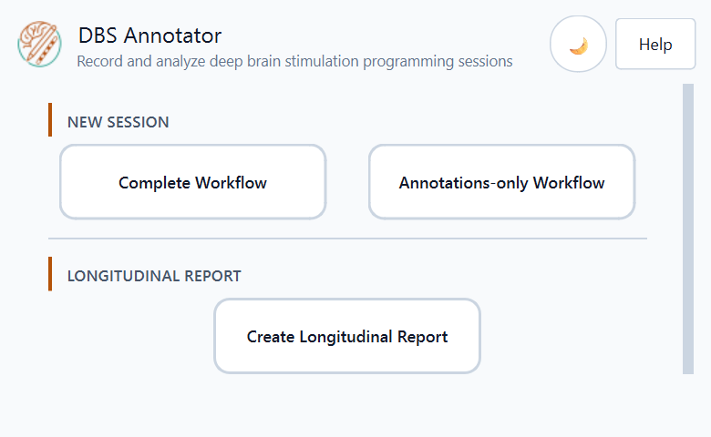
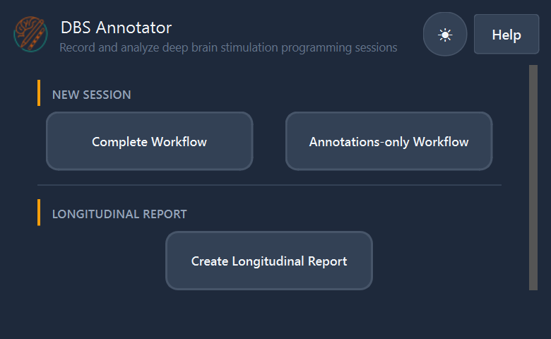
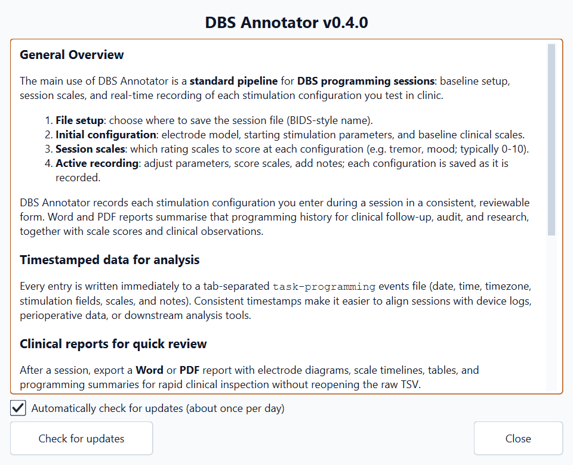
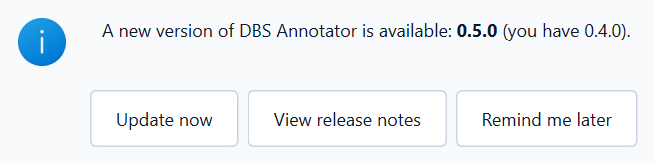
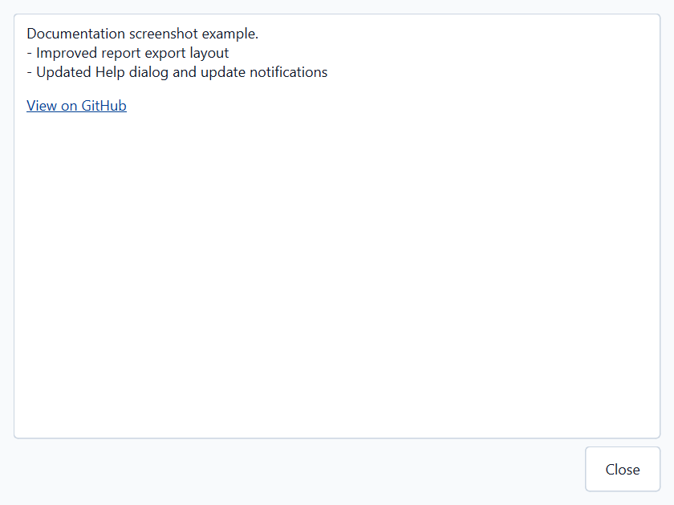

Quick Start
===========

This page walks you through opening the application and choosing the workflow
that fits your session.  For the motivation behind the tool
and how it is designed, see :doc:`overview`.

----

Launching the Application
--------------------------

After :doc:`installation`, open **DBS Annotator** from your system's application
launcher (the installed app, not a loose ``.exe`` in a download folder):

* **Windows**: **Start** menu entry **DBS Annotator** (from the ``.msi``
  installer or the PowerShell install script shortcut).
* **macOS**: *Applications* after installing from the ``.dmg`` or install
  script.
* **Linux**: application menu after installing the ``.deb`` or install script.

The main window opens on the **Home screen**.

----

Choosing Your Workflow
-----------------------

From the home screen you can start one of three workflows:

.. list-table::
   :widths: 25 75
   :header-rows: 1

   * - Button
     - When to use it
   * - **Complete Workflow**
     - You are about to perform a DBS programming session and want to record
       stimulation parameters, clinical scales, and notes in real time.
   * - **Annotations-only Workflow**
     - You only need timestamped text notes, without stimulation parameters or
       clinical scale values.
   * - **Create Longitudinal Report**
     - You already have multiple programming-session TSV files from the same
       subject across previous visits and want a combined comparative report.
       Example BIDS filename:
       ``sub-XX_ses-YYYYMMDD_task-programming_run-XX_events.tsv``

----

Interface Overview
------------------

The application window contains three persistent elements:

* **Top bar**: application title, current file name, and the Dark / Light theme
  toggle (☀ / ☾ icon).
* **Main area**: changes with each step of the workflow.
* **Bottom navigation**: *Back* and *Next* / action buttons.

Theme Toggle
^^^^^^^^^^^^

Click the **☀ / ☾** button in the top-right corner at any time to switch
between the light and dark colour scheme. Your preference is applied immediately
and maintained between pages.

Help and Updates
^^^^^^^^^^^^^^^^

Click the **?** button in the top-right corner of the title bar (next to the
theme toggle) to open the **Help** dialog. It summarises the main workflow,
copyright and support links, and includes **Check for updates** plus an
optional daily auto-check.

When a newer release is published, the app shows an update notification with
**View release notes**, **Update now** (when supported), and **Remind me later**.

From **View release notes** you can read the full changelog text for that
release.

See :doc:`faq` for network privacy and update-check behaviour.

----

Next Steps
----------

* :doc:`workflow_complete` — **Complete Workflow**
* :doc:`workflow_annotations` — **Annotations-only Workflow**
* :doc:`longitudinal_report` — **Create Longitudinal Report**
* :doc:`output_format` — **Output Format**
