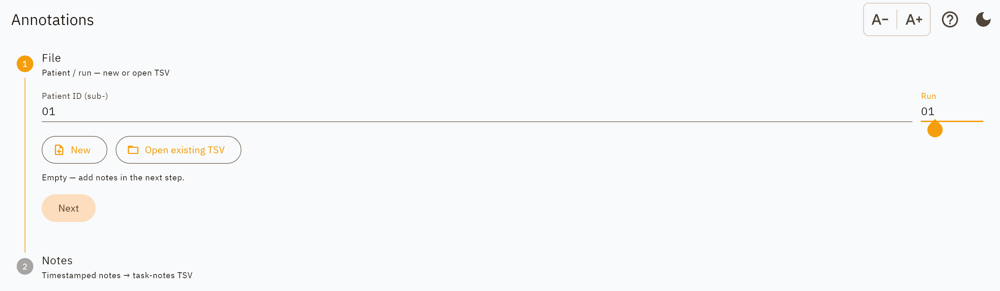
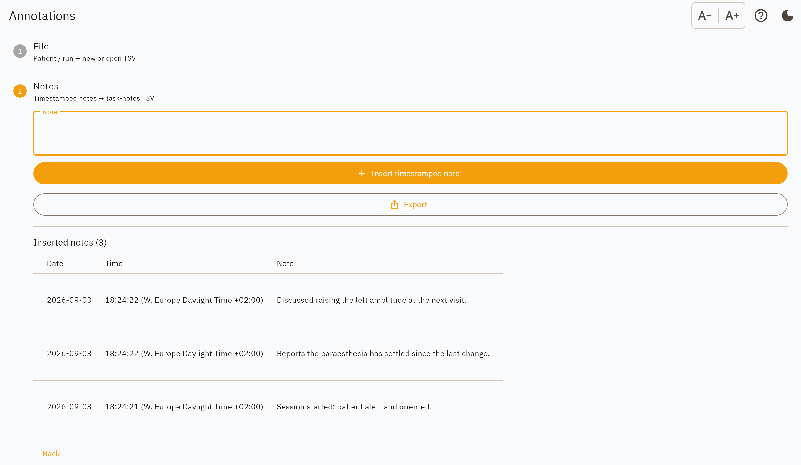

Annotations only
================

Timestamped free-text notes and nothing else. Use it when there is no
stimulation data to capture, as in a clinic conversation or a follow-up call,
but the timing and the wording still matter.

Step 0: File
------------

         entered
   :width: 100%

   The same File step as the complete workflow, minus everything that only a
   programming session needs.

Enter the patient ID and run number and choose where to save. The filename uses
``task-notes`` rather than ``task-programming``:

.. code-block:: text

   sub-01_ses-20260203_task-notes_run-01_beh.tsv

Step 1: Notes
-------------

         of date, time and text
   :width: 100%

   Three notes inserted. The list is newest-first, which is right for typing.

Type an observation and insert it. Each insert is stamped with the instant you
pressed the button, offset included, and not with the moment the file is later
saved or exported.

Inserted notes are listed below the field so you can check what has been
recorded rather than trusting a confirmation message. Every insert is written to
the file immediately.

Output
------

Two columns, ``acq_time`` and ``notes``, with one row per note. The on-screen
list splits that single timestamp into a date and a clock time for reading; the
file keeps it whole. See :doc:`../output_format` for the column reference.

Both of those column names also appear in a programming session file, so the
notes format is a strict subset of the session format and the same tooling
reads either.

Reports
-------

**Export** produces a PDF or Word report, the raw TSV, or a
:ref:`BIDS dataset <bids-dataset-export>`.

The report is deliberately plain: a patient header, the session date taken from
the notes themselves rather than from the export clock, the notes in a
time-and-text table in the order they happened, and an attestation block. Page
footers carry the patient ID, session date and page number, so a page separated
from the rest is still attributable.

The on-screen list shows newest first, which is right for typing, while the
report is oldest first, which is right for reading a session back.
