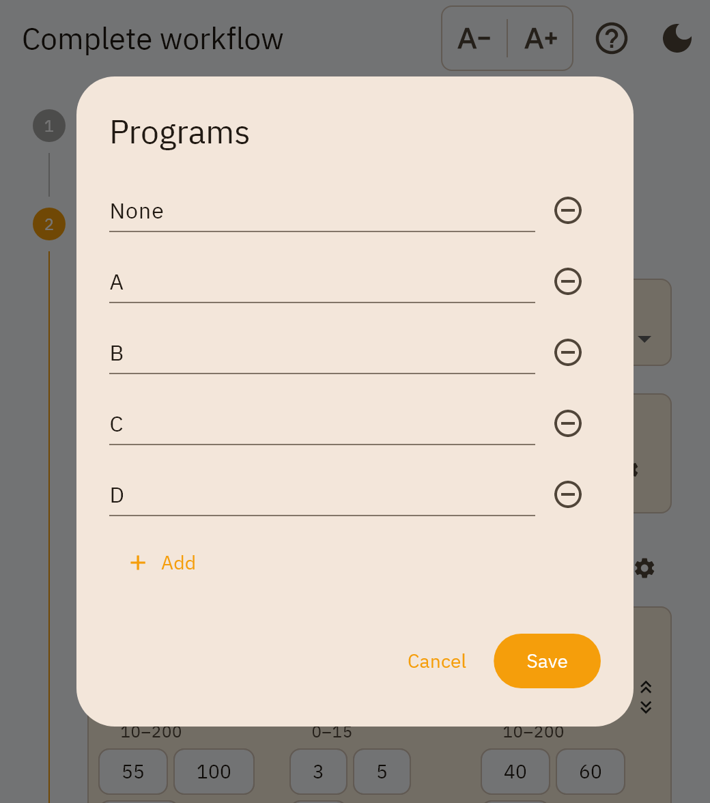
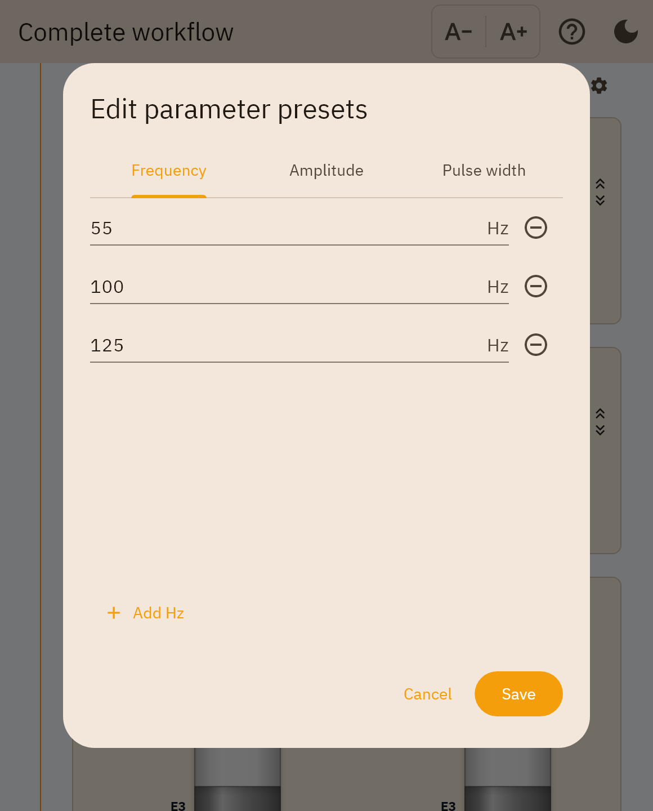
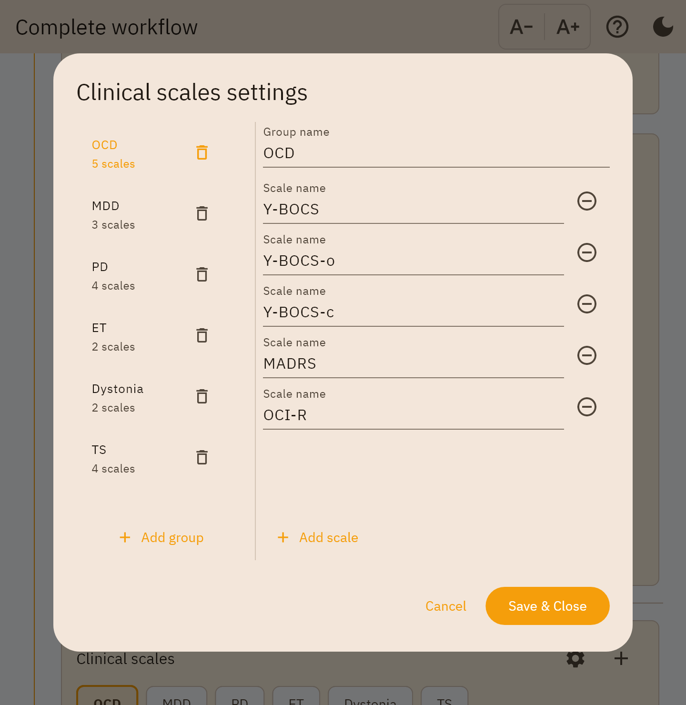
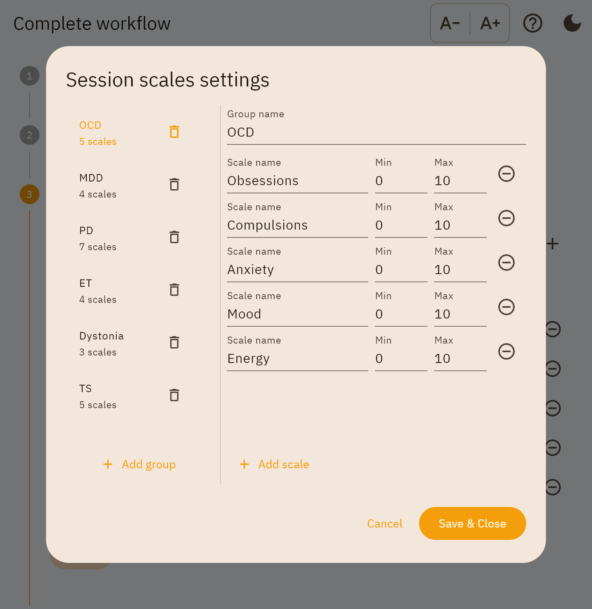
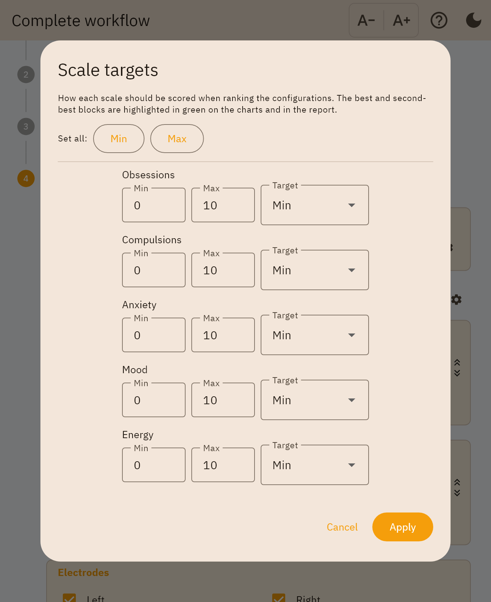
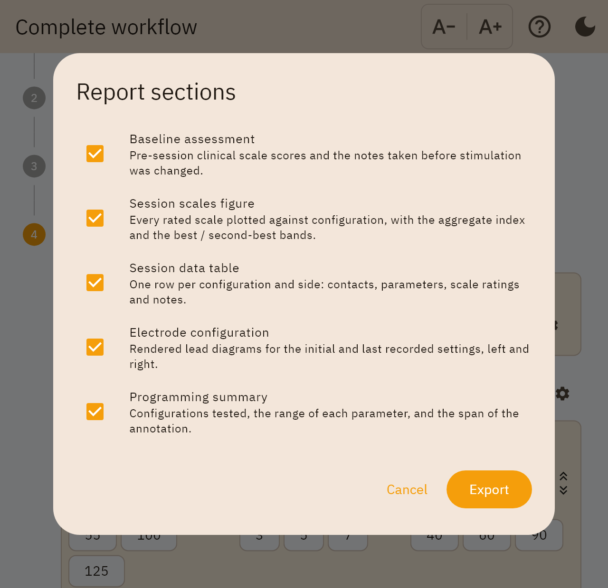
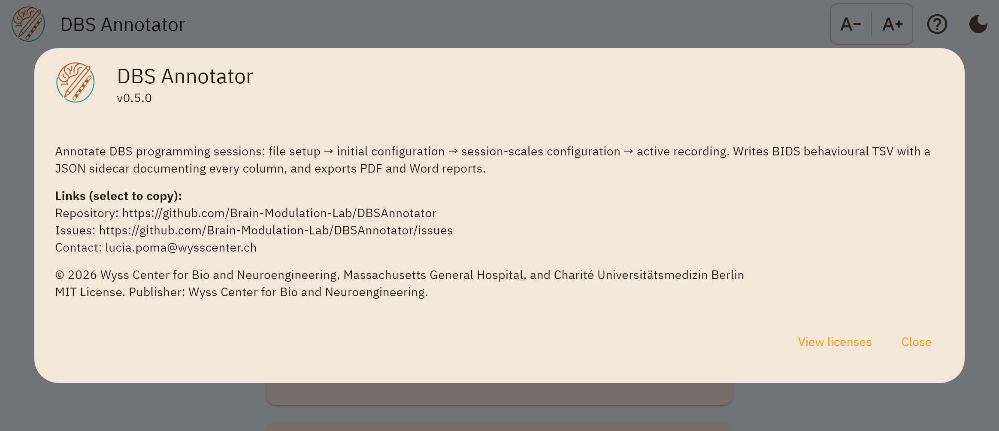

Dialogs and settings
====================

Every dialog in the app, what opens it, and what it changes. Two kinds are mixed
here on purpose, and the difference matters:

**Session settings** apply to the file you are recording now and are written into
it.

**Presets** apply to every future session and are stored in the app's own
preferences, never in a session file. Editing a preset does not change any
session already recorded.

.. _dialog-programs:

Programs
--------

Opened by the gear beside the **Program** card in steps 1 and 3.

The stimulation programme labels offered by the dropdown — ``A``, ``B``, ``C``
and so on, or whatever your centre uses. Stored as a preset, so the list you
build is there next session.

.. _dialog-parameter-presets:

Parameter presets
-----------------

         Pulse width
   :width: 100%

Opened by the gear beside **Parameters** in steps 1 and 3.

The quick-pick chips under each stimulation field, one tab per parameter. These
are shortcuts, not limits: the ranges a value is validated against come from the
contract in ``schema/limits.json``, not from this list.

A value that is not a number, or that falls outside the permitted range, is
refused with the reason shown in the dialog rather than being silently dropped.

.. _dialog-clinical-scales:

Clinical scales settings
------------------------

         selected group's scale names on the right
   :width: 100%

Opened by the gear on the **Clinical scales** card in step 1.

Edits the disease preset buttons for the baseline assessment — the group names
(OCD, MDD, PD, ET, Dystonia, TS) and the scale names inside each. A clinical
scale is just a name and a score, so a row here is one field.

.. _dialog-session-scales:

Session scales settings
-----------------------

         maximum as well as a name
   :width: 100%

Opened by the gear on **Session scales configuration** in step 2.

The same master-detail shape as the clinical dialog, with one difference that is
the reason both are documented: each row here also carries a **minimum and
maximum**. Session scales are rated on a slider at every configuration, so they
need a range; clinical scales are typed once, so they do not.

.. _dialog-scale-targets:

Scale targets
-------------

         a target mode
   :width: 100%

Opened by **Scale targets** in step 3, from the single-session report screen, or
from the report-sections dialog.

Says what "better" means for each scale, which is the input the ranking needs and
the one thing only you can supply. **Set all: Min / Max** fills the column in one
tap for a set of scales that all run the same way.

Each scale gets a mode — ``Min``, ``Max``, ``Custom`` (closest to a stated value,
which reveals a *Value* field), or ``Ignore``. Until targets are set, no
configuration is ranked anywhere: see :ref:`scale-targets` for the definition of
the aggregate index and :ref:`what-the-reports-do-not-say` for its limits.

.. _dialog-report-sections:

Report sections
---------------

         section
   :width: 100%

Appears when you export a session report, before the save dialog.

Chooses which sections the document contains. Each has a one-line description of
what it adds. **Export** is disabled while nothing is checked, because a report
of a title page alone is not a document anyone wants. **Scale targets…** opens
the dialog above without losing the selection — the ranking those targets drive
is what two of these sections show.

The selection is remembered for the next export.

.. _dialog-about:

Help / about
------------

         contact links
   :width: 100%

Opened by the **?** in the top bar of every screen.

The version, the licence, and where to report a problem. The version here is the
one stamped into every report footer, so it is what to quote in a bug report.
Links are selectable text rather than buttons: the app opens no browser, because
it makes no outbound connections at all. See :doc:`../privacy`.
