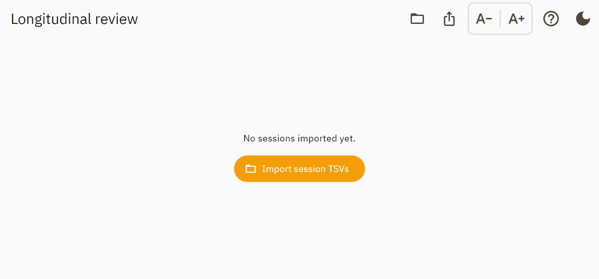
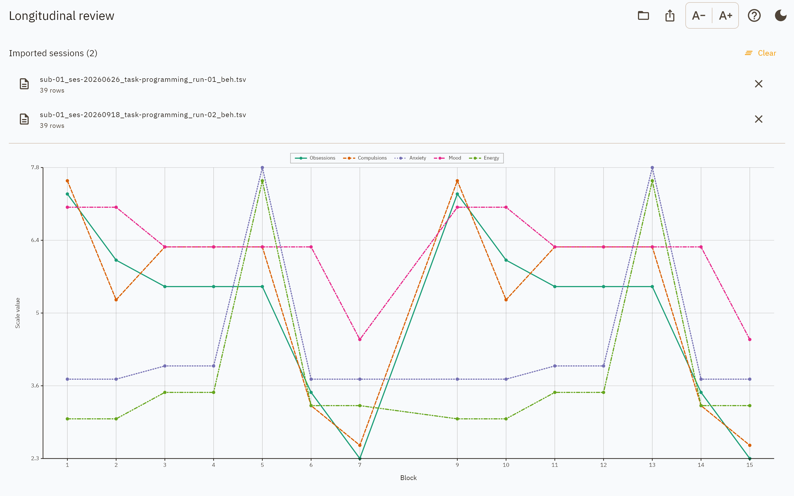
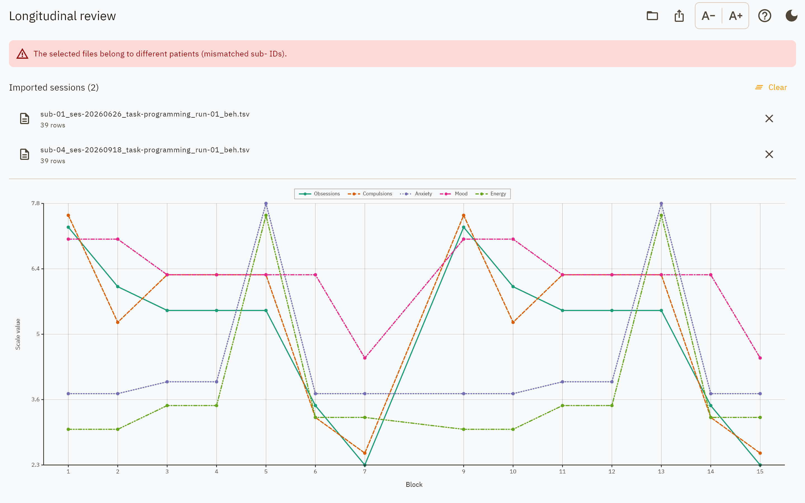

Longitudinal review
===================

Several sessions of one patient, compared across visits. Like the single-session
report screen, this one only reads.

   Before anything is imported.

Importing
---------

**Import session TSVs** takes several files at once. Each is checked before it is
accepted: a file whose columns are not a programming session is rejected by name,
rather than importing as a screen full of blank rows.

         across the blocks of both visits
   :width: 100%

   Two visits of one patient. Block indices run on from one file to the next, so
   the visits read left to right.

The list names every imported file with its row count, and individual files can
be removed without starting over.

Different patients
------------------

         patients, above the file list
   :width: 100%

   Files whose ``sub-`` labels disagree.

Combining two people into one longitudinal report is a safety problem, not a
formatting one, so it is said in a banner on the screen and repeated in a box on
the first page of the report. The files are still charted — the app does not
decide for you which one was the mistake — but nothing about the result is
presented as belonging to one patient.

Reports
-------

**Export** produces a PDF or Word report of the imported set, or lays the files
out as a :ref:`BIDS dataset <bids-dataset-export>` — the tidying step that turns
a folder of loose downloads into ``sub-XX/ses-YYYYMMDD/beh/``.

The report carries two figures, because they answer different questions:

**Clinical scales by visit.** One assessment per visit, so the x axis is the
visit itself, labelled ``<date>_<run>``. This is the "is the patient better than
last time" figure.

**Session scales by visit and block.** Several configurations per visit, so each
visit contributes a run of points.

Then a per-visit table — date, the programme in force at the end of that visit,
number of blocks, the primary clinical scale and its change from the previous
visit — with the source file list as an appendix.

The report file is named ``sub-<label>_desc-longitudinal_report.pdf``. It carries
no ``ses-`` entity because it spans several, and no ``task-`` entity because
"longitudinal" is not a task the app records: ``desc-`` is the BIDS entity for
naming what a computed file is.

See :doc:`../reports` for the full section list.
