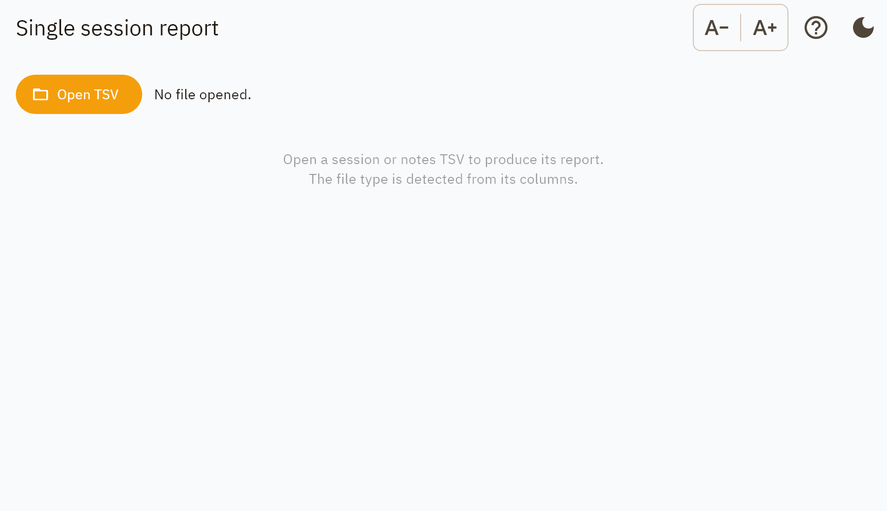

Single session report
=====================

Open a TSV that already exists and get its report. This screen writes nothing: it
reads the file, shows what is in it, and exports a document. It is the safe way
to produce a report for a session someone else recorded, or one recorded weeks
ago.

         "Open TSV"
   :width: 100%

   Before a file is opened. The Export control appears only once there is
   something to export.

Opening a file
--------------

The file type is detected from its **columns**, not from its name, so a file
renamed by hand still opens as what it is. Both kinds are accepted:

**A programming session** shows the block count and the electrode model, then the
same review charts and entries table as the recording step. Two things are said
plainly when they are true:

* the file names an electrode model the catalogue does not have, so the lead
  diagrams cannot be drawn;
* no :ref:`scale targets <scale-targets>` are set, so nothing is ranked.

**An annotations file** shows the notes as a plain list.

Exporting
---------

**Export** offers PDF or Word. For a session file the
:ref:`report sections <dialog-report-sections>` dialog appears first, and the
:ref:`scale targets <dialog-scale-targets>` can be set from there or from the
button beside the preview. For a notes file every section applies, so the dialog
is skipped.

The report is named from the source file's own BIDS entities with the data suffix
replaced by ``_report``, so the two sort together in a directory listing:

.. code-block:: text

   sub-01_ses-20260626_task-programming_run-01_beh.tsv
   sub-01_ses-20260626_task-programming_run-01_report.pdf

A file whose name carries no ``sub-`` entity keeps its own stem rather than
having one invented for it — a wrong subject label on a clinical document is
worse than an unhelpful filename.

See :doc:`../reports` for what the document contains.
