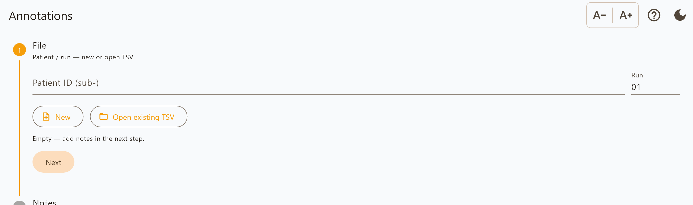

Annotations only
================

Timestamped free-text notes and nothing else. Use it when there is no
stimulation data to capture — a clinic conversation, an observation session, a
follow-up call — but the timing and the wording still matter.

Recording
---------

**File.** Enter the patient ID and run number and choose where to save. The
filename uses ``task-notes`` rather than ``task-programming``:

.. code-block:: text

   sub-01_ses-20260626_task-notes_run-01_events.tsv

**Notes.** Type an observation and insert it. Each insert is stamped with the
date, time and UTC offset at the moment you pressed the button — not when the
file is later saved or exported.

Inserted notes are listed below the field, newest first, so you can check what
has been recorded rather than trusting a confirmation message.

Every insert is written to the file immediately.

Output
------

Four columns: ``date``, ``time``, ``timezone``, ``notes``. One row per note. See
:doc:`output_format` for the column reference.

Because the format is a strict subset of the session format, the same tooling
reads both.

Reports
-------

**Export** produces a PDF or Word report, or the raw TSV.

The report is deliberately plain: a patient header, the session date taken from
the notes themselves rather than from the export clock, the notes in a
time-and-text table in the order they happened, and an attestation block. Page
footers carry the patient ID, session date and page number, so a page separated
from the rest is still attributable.

Note that the on-screen list shows newest first — right for typing — while the
report is oldest first, which is right for reading a session back.
