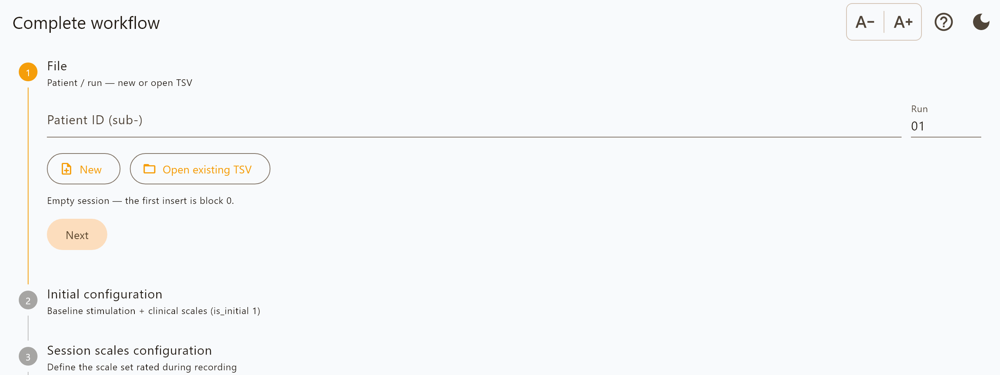

Complete workflow
=================

The full session: stimulation parameters, electrode configuration, scale ratings,
side effects and notes, recorded configuration by configuration.

The screen is a four-step wizard. Steps 1 and 3 share a two-row layout — what was
*delivered* on top (parameters and electrodes), what was *observed* below (scales,
side effects, notes) — which follows the order the work is actually done in.

Step 0 — File
-------------

Enter the **patient ID** and **run number**, then choose where to save. The app
composes the :doc:`BIDS filename <output_format>` and creates the file straight
away, so every later insert has somewhere to go.

*Open* loads an existing session instead, and appends to it. Opening a file also
adopts the **electrode model named in that file**, so the lead diagrams show the
patient's actual hardware rather than whatever the dropdown last held. If the
file names a model that is not in the catalogue, the app says so rather than
drawing the wrong lead.

A file that is not a programming session — an annotations file, say — is refused
with an explanation, rather than loading as empty rows.

Step 1 — Initial configuration
------------------------------

The state the patient arrived in, before anything is changed.

**Electrode model.** Choose the implanted lead. The catalogue covers Medtronic,
Boston Scientific, Abbott, PINS and ALEVA leads, including segmented
(directional) models. The diagrams are drawn to each lead's real contact heights
and spacings, so two different leads look different.

**Parameters, per side.** Frequency, amplitude and pulse width, with quick-pick
presets. When more than one cathode is active, an amplitude split appears so you
can set the percentage per contact.

**Electrodes.** Tap a contact to cycle it: off → anode → cathode → off. Tap the
case to use it as the return. Segmented levels show their three segments plus a
*Ring* strip that activates the whole level at once. Invalid combinations are
flagged as you build them.

**Clinical scales.** The baseline assessment — disease-specific scores such as
Y-BOCS or UPDRS-III. Disease presets fill the list in with a tap.

**Notes.** Free text. Unlike the recording step, these persist after inserting,
so you can keep refining the baseline description.

Inserting records this as the **baseline block** (``is_initial = 1``).

Step 2 — Session scales configuration
-------------------------------------

Name the scales to be rated at *every* configuration, with a minimum and maximum
for each. Keeping the set fixed for the whole session is what makes the ratings
comparable between configurations.

Choosing a disease preset here — or having chosen one in step 1 — fills the list.
The gear icon edits the presets themselves, which persist between sessions.

Step 3 — Recording
------------------

The loop, repeated once per configuration tried.

Set the parameters and contacts as in step 1, then rate each scale. A scale that
was not assessed can be marked omitted, which writes ``NaN`` rather than a made-up
number.

**Side effects** have their own field, separate from notes, because a side effect
is the tolerability record for that configuration and should not be buried in
free text.

Insert to record the block. Notes and side effects clear, ready for the next one;
the parameters stay, so a single amplitude change is one edit rather than a full
re-entry.

Reviewing as you go
~~~~~~~~~~~~~~~~~~~

Below the entry area, everything inserted so far is shown two ways.

**Four charts** sharing one time axis: session scales, amplitude, pulse width and
frequency. The panels are aligned vertically, so a dip in a scale can be read
against the amplitude that preceded it. They scroll horizontally, showing the
most recent configurations by default, with zoom controls and drag handles to
reorder the panels.

**A table** of every entry, grouped by block, with a heavy rule at each block
boundary. Values that belong to the block — time, programme, parameters — are
printed once rather than repeated on every scale row.

**Scale targets** sets what "better" means per scale (minimise, maximise, or
closest to a value). Once set, the best- and second-best-scoring configurations
are shaded green across all four charts. Until set, nothing is ranked.

Exporting
---------

**Export** offers PDF, Word, or the raw TSV. The report sections are selectable,
and paper size (A4 or Letter) applies to both document formats. See
:doc:`reports`.
