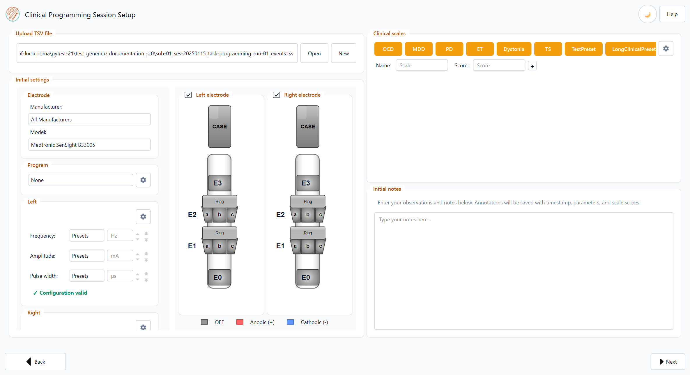
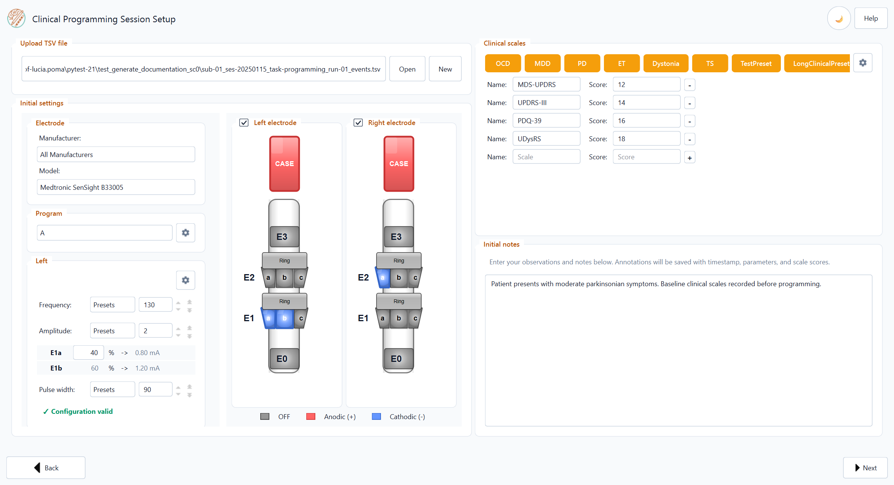
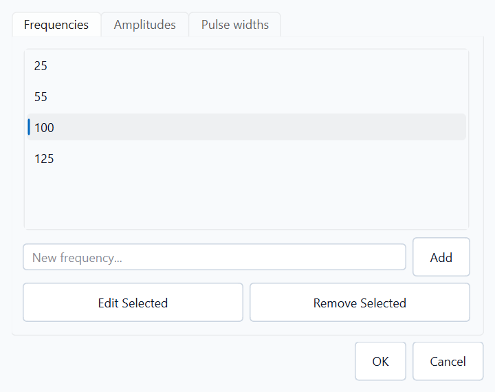
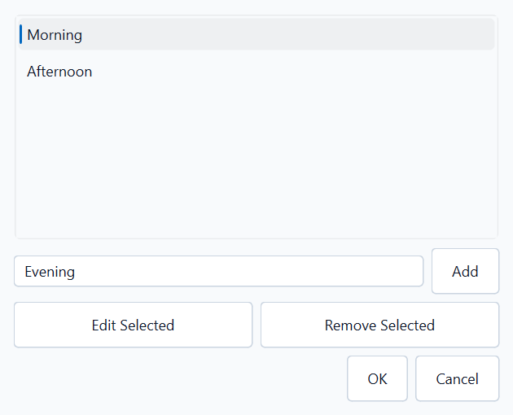
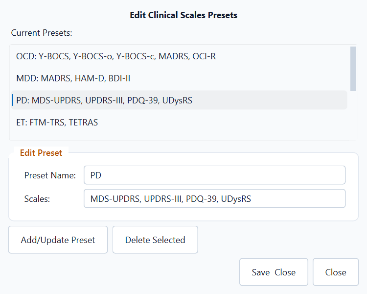
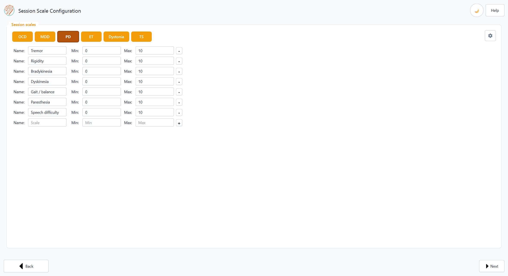
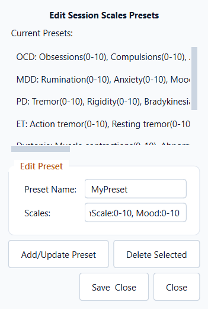
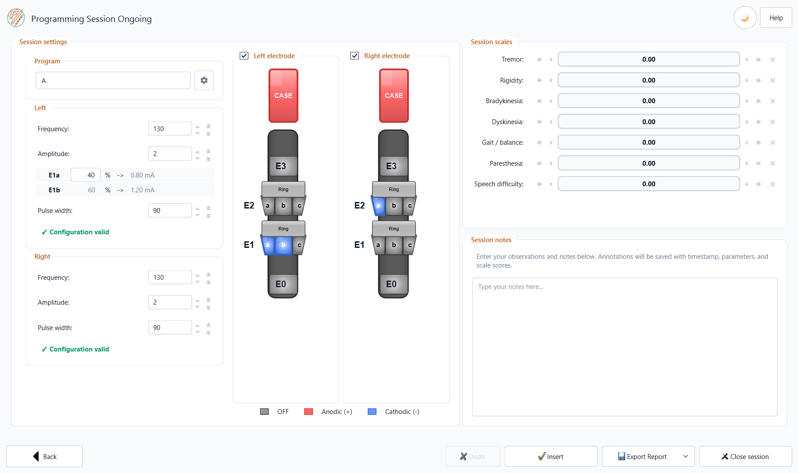
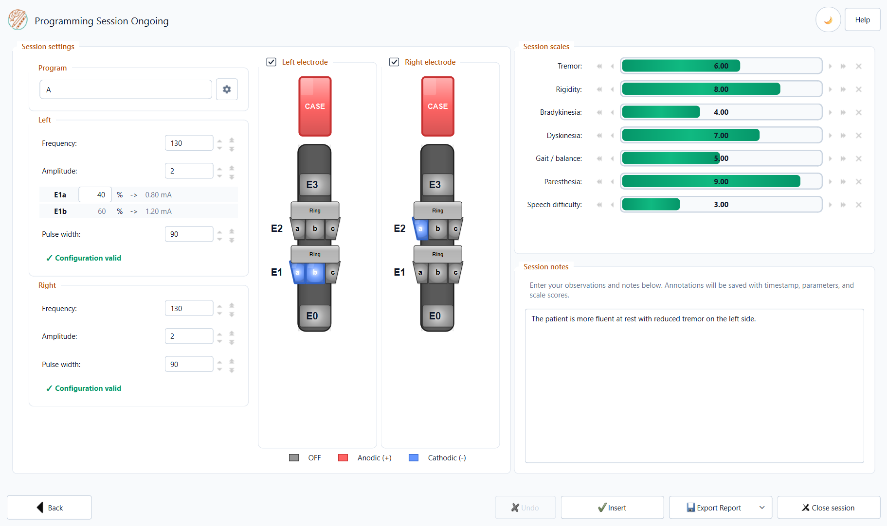

Complete Workflow
=================

The **Complete Workflow** guides you through a DBS programming session in
**four steps**.  Data is saved automatically after each entry; you never need to
press a manual "Save" button.

----

Step 0 — File setup
--------------------

On **Clinical Programming Session Setup**, use **Upload TSV file** to choose or
create the session file:

* **Open** — load an existing programming-session ``.tsv``.
* **New** — enter **Patient ID** and **Run ID** in the dialog; **Session ID**
  is set automatically to today's date (``ses-YYYYMMDD``).  Pick the save
  location in the file dialog.
* Drag and drop a ``.tsv`` onto the path field.

Output filename
^^^^^^^^^^^^^^^

A new file uses this BIDS-style name::

   sub-<ID>_ses-<YYYYMMDD>_task-programming_run-<NN>_events.tsv

If a file with that name already exists, you are asked whether to append to
it or create a new run.

----

Step 1 — Initial Configuration
-------------------------------

Electrode Model
^^^^^^^^^^^^^^^

Select the implanted electrode model from the **Model** dropdown.  Optionally,
pick a **Manufacturer** to narrow the list.  The application supports common DBS
leads from Medtronic, Abbott, Boston Scientific, and other vendors.  The Step 1
screenshot above shows the interactive diagram (example:
Medtronic SenSight B33005, left and right hemispheres).

Contact Selection
^^^^^^^^^^^^^^^^^

Click directly on the electrode diagram to select contacts:

* **Cathode (−)** — primary stimulating contact(s); highlighted in blue.
* **Anode (+)** — return contact; highlighted in red.

For **directional leads** (e.g. Medtronic SenSight), you can select
individual directional segments (A, B, C) independently for each level.

.. tip::
   You can select multiple cathodes.  The amplitude split widget below the
   diagram lets you distribute the total current across selected contacts
   by percentage.

Stimulation Parameters
^^^^^^^^^^^^^^^^^^^^^^

.. list-table::
   :widths: 30 70
   :header-rows: 1

   * - Parameter
     - Notes
   * - **Amplitude (mA)**
     - Enter total amplitude.  If multiple cathodes are selected, use the
       split widget to assign percentages.
   * - **Frequency (Hz)**
     - Stimulation frequency.
   * - **Pulse width (µs)**
     - Pulse width.
   * - **Program**
     - Stimulation program label (e.g. A, B, C, D).  Use the gear icon next to
       the **Program** dropdown to add custom program names beyond the built-in
       defaults (None, A, B, C, D).

Both the **Left** and **Right** hemispheres have independent parameter panels.

Preset dropdowns
""""""""""""""""

Each stimulation row (frequency, amplitude, pulse width) has a **Presets**
dropdown beside the numeric field.  Pick a value to fill the field; the dropdown
returns to **Presets** after selection.

Permanent preset customisation
""""""""""""""""""""""""""""""

Click the gear icon at the top of the **Left** or **Right** stimulation panel
(same dialog for both sides) to open **Edit Setting Presets**.  Three tabs let
you manage the frequency, amplitude, and pulse-width lists used by those
dropdowns:

* **Add** — enter a value and click **Add**.
* **Edit Selected** / **Remove Selected** — change or delete a list entry.
* **OK** — save to ``setting_presets.json`` (bundled defaults plus your user
  file under application data).

Custom program names
""""""""""""""""""""

Click the gear icon beside the **Program** dropdown to open **Edit Program
Names**.  Add names beyond the built-in labels (None, A, B, C, D); they appear
in the program combo on Step 1 and Step 3.  Default programs cannot be renamed
or removed.

Clinical Scales
^^^^^^^^^^^^^^^^^^^^^^^^^

Below the stimulation parameters you will find a panel for **clinical
scales** (validated rating instruments recorded once at the start of the
session).  Click a **preset button** (OCD, MDD, PD, ET, Dystonia, TS) to load
the standard scale set for that indication, or use the settings control to
customise presets.

Built-in clinical presets (Step 1):

* **OCD** — Y-BOCS, Y-BOCS-o, Y-BOCS-c, MADRS, OCI-R
* **MDD** — MADRS, HAM-D, BDI-II
* **PD** — MDS-UPDRS, UPDRS-III, PDQ-39, UDysRS
* **ET** — FTM-TRS, TETRAS
* **Dystonia** — BFMDRS, TWSTRS
* **TS** — YGTSS, PUTS, TS-CGI, Y-BOCS

Managing scales for this session
""""""""""""""""""""""""""""""""

Under **Clinical scales**, only rows where you enter a numeric **Score** are
written to the TSV when you continue.  Preset scales stay visible even if you
leave the score blank — they are simply omitted from the file.

* Click **−** on a row to remove that scale from the current session list.
* To add a scale for **this session only**, type the name and score in the empty
  row at the bottom, then click **+** to open another blank row.

Permanent preset customisation
""""""""""""""""""""""""""""""

To change the built-in preset buttons for all future sessions, click the
**settings** control (gear icon, top right of the Clinical scales panel).  The
**Clinical Scales Settings** dialog lets you:

* Select a preset from the list and edit its scale names.
* **Add/Update Preset** — enter a **Preset Name** and **Scales** as a
  comma-separated list (e.g. ``Y-BOCS, MADRS, HAM-D``).
* **Delete Selected** to remove a preset.
* **Save & Close** to persist your changes.

----

Step 2 — Session Scale Selection
--------------------------------

Choose which session scales to track **during the session** (i.e. at each
stimulation configuration tested).

Built-in presets
^^^^^^^^^^^^^^^^

Use the preset buttons to load a standard **session scale** set (rated at each
stimulation configuration during programming).  All built-in session scales use
a **0–10** numeric range with slider controls.

* **OCD** — Obsessions, Compulsions, Anxiety, Mood, Energy
* **MDD** — Rumination, Anxiety, Mood, Energy
* **PD** — Tremor, Rigidity, Bradykinesia, Dyskinesia, Gait / balance,
  Paresthesia, Speech difficulty
* **ET** — Action tremor, Resting tremor, Paresthesia, Speech difficulty
* **Dystonia** — Muscle contractions, Abnormal posture, Pain
* **TS** — Tic severity, Premonitory urge, Control over tics, Anxiety,
  Impulsivity

Managing scales for this session
""""""""""""""""""""""""""""""""

As on Step 1, you configure which scales appear in Step 3.  Each row has a
**Name**, **Min**, and **Max** value that define the rating range used by the
sliders during recording.  Built-in presets use **0** and **10** by default.

* Click **−** to remove a scale from the current session list.
* Type **Name**, **Min**, and **Max** in the empty row at the bottom, then click
  **+** to add another row.

Permanent preset customisation
""""""""""""""""""""""""""""""

Click **settings** (top right of the Session scales panel) to open **Session
Scales Settings**.  You can delete presets, edit existing ones, or create a new
preset:

* **Preset Name** — label shown on the preset button (e.g. ``MyPreset``).
* **Scales** — comma-separated entries in the form ``Name:min-max``, for example
  ``Mood:0-10, Anxiety:0-10, Custom:0-5``.

Click **Add/Update Preset** to stage the entry, then **Save & Close** to keep
your changes.  (The screenshot below shows a new preset being drafted; it is
not saved until you confirm.)

In Step 3, each session scale is rated with a **slider** (0–10 for built-in
presets).  Press **✕** on a slider to mark that scale as not assessed (stored
as ``NaN`` and excluded from reports).

----

Step 3 — Active Recording
--------------------------

This is the main working screen during the programming session.

Adjusting Stimulation Parameters
^^^^^^^^^^^^^^^^^^^^^^^^^^^^^^^^^^

Modify stimulation parameters the same way as in Step 1.  The electrode
diagram and parameter fields are fully editable.

Recording an Entry
^^^^^^^^^^^^^^^^^^^

1. Adjust the stimulation parameters to the new configuration.
2. Fill in the clinical scale sliders.
3. Optionally add a free-text **note** in the Notes field.
4. Click **Insert** to record an entry.

Each recorded entry is appended as new rows in the TSV file with the current
timestamp.

Session Table
^^^^^^^^^^^^^

All recorded entries are displayed in a live table at the bottom of the
screen.  The **best entry** (determined by scale optimisation) is highlighted
in green.

.. tip::
   You can record as many entries as needed within a session.  There is no
   limit on the number of configurations tested.

Exporting the Report
^^^^^^^^^^^^^^^^^^^^^

Click **Export Report** → **Word Report** or **PDF Report**.

Before the file-save dialog appears, two dialogs will be shown:

1. **Scale Optimisation** — for each clinical scale, choose whether the
   **minimum**, **maximum**, or a **custom target** value defines the "best"
   outcome.  Uncheck a scale to exclude it from the calculation.

   .. image:: _static/scale_optimization_dialog.png
      :alt: Scale optimisation dialog
      :class: screenshot-native

2. **Report Sections** — choose which sections to include in the report.
   By default all main sections are checked.  Under **Session Data** you can
   include the timeline chart, the lateral data table, or both:

   * **Initial Clinical Notes** — clinical scale scores and initial notes
   * **Session Data** — parent section; expand to choose:

     * **Session Data Graph** — timeline chart of session-scale values across
       recorded configurations (best entry highlighted per scale)
     * **Session Data Table** — lateral table (L/R rows) with stimulation
       parameters, scale values, and notes

   * **Electrode Configurations** — initial vs final contact diagrams
   * **Programming Summary** — session duration and parameter ranges

   .. image:: _static/report_sections_dialog.png
      :alt: Report sections dialog
      :class: screenshot-native

3. Choose the **save location** for the report file.

Report Contents
^^^^^^^^^^^^^^^^

The generated report includes (depending on the selected sections):

* **Initial Clinical Notes** — baseline clinical scale scores and initial
  notes from Step 1.
* **Session Data** — optional **timeline chart** (one line per session scale,
  x-axis = ``block_ID``) and/or **data table** of all recorded entries
  with stimulation parameters, scale values, and notes.  The best entry per
  scale is highlighted in green according to your optimisation choices.
* **Electrode Configurations** — visual diagrams showing the initial and
  final electrode contact selection (Left and Right hemispheres).
* **Programming Summary** — session duration, number of configurations
  tested, and parameter ranges per hemisphere.

----

Closing the Session
-------------------

Click **Close session** when the programming session is finished.  The TSV
file is finalised and the application returns to the home screen.

.. warning::
   Do not delete or rename the ``.tsv`` file while the application is open.
   Always close the session first.
